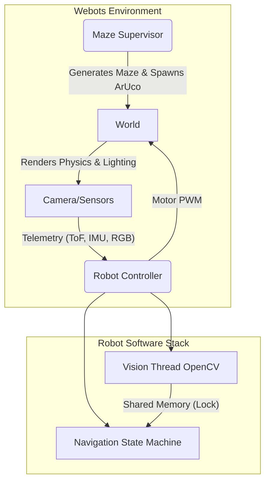
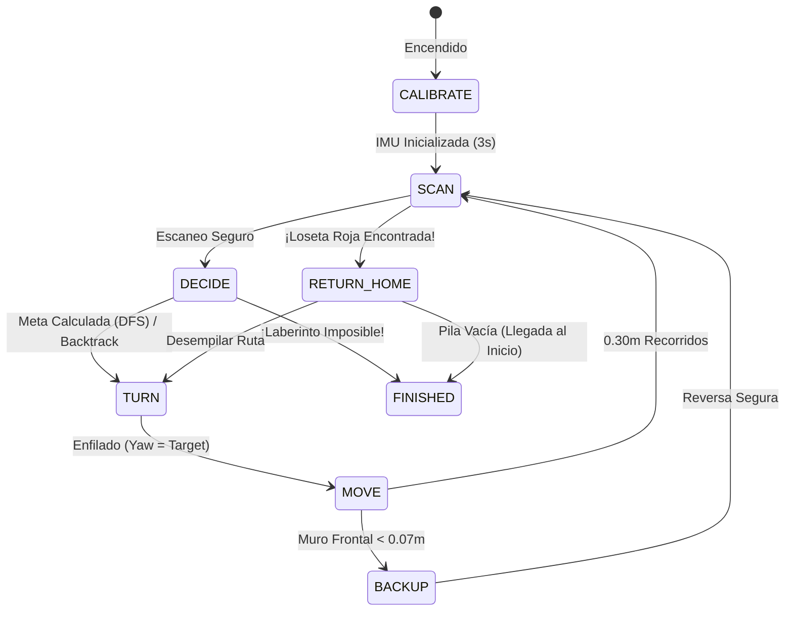

<div align="center">
  <h1>🤖 Webots Sim2Real Maze Solver</h1>
  <p><strong>Un agente robótico autónomo con visión artificial, navegación IMU/ToF y resolución de laberintos por Fuerza Bruta (DFS) y retorno a casa.</strong></p>
</div>

---

## 📌 Descripción del Proyecto

Este proyecto es una simulación avanzada de robótica en **Webots** diseñada como prueba de concepto para la transición **Sim2Real** (Simulación a Realidad). Un robot diferencial completamente autónomo es lanzado en un laberinto de **5x5** generado procedimentalmente. Su objetivo principal es mapear el laberinto, esquivar paredes mediante reflejos biológicos, localizar visualmente su meta, y retornar de manera segura sobre sus propios pasos hasta el punto de inicio.

## 🚀 Características Principales

*   **Generación de Entorno Procedimental**: Un supervisor en Python genera un nuevo laberinto (con texturas, rampas, topes e iluminación asimétrica) cada vez que se reinicia el entorno.
*   **Visión Artificial Híbrida (OpenCV 5.x)**: Procesamiento concurrente de dos cámaras. Una cámara superior para lectura de **ArUco (DICT_4X4_50)** y una cámara inferior en picada a 45° para segmentación espacial por colores **HSV**.
*   **Navegación Absoluta y Relativa**: Fusión de datos sensoriales combinando la **Brújula Inercial (IMU)** para giros perfectos y **Sensores de Tiempo de Vuelo (ToF)** para inyectar corrección proporcional "Subconsciente" de pasillos.
*   **Inteligencia de Resolución**: Exploración metódica a través del algoritmo de Búsqueda en Profundidad (**DFS**), con retrocesos dinámicos en los callejones sin salida y capacidad de retorno autónomo al origen usando la memoria de pila.

---

## 🧠 Arquitectura de Software

El sistema funciona con un enfoque de agentes separados en Webots. El mundo (la física y generación del mapa) está gobernado por el **Supervisor**, mientras que el **Controlador del Robot** actúa con memoria e inteligencia limitada a sus sensores, garantizando la compatibilidad estricta Sim2Real.



---

## 🧭 Lógica de Navegación: Máquina de Estados (FSM)

El cerebro del robot está modelado sobre una Máquina de Estados Finitos altamente desacoplada y predecible. 



### El Reflejo de Centrado Activo (Biological Reflex)

Durante el estado `MOVE`, el robot no viaja a "ciegas". Depende de un controlador proporcional basado en sus láseres laterales (ToF) que constantemente calcula:
$$ \text{Centering Error} = \text{Distancia Izquierda} - \text{Distancia Derecha} $$
$$ \text{Corrección PWM} = K_c \times \text{Centering Error} $$

Esto le permite evitar ser rasgado por las paredes independientemente del ruido inercial o colisiones previas.

---

## 👁️ Sistema de Visión (OpenCV)

El procesamiento de imágenes corre en un hilo secundario asíncrono para mantener los 32ms de latencia en los motores intactos.

1.  **Reconocimiento de Marcadores (ArUco)**: 
    * El supervisor genera aleatoriamente un marcador ID entre 0-49 y lo adhiere a una pared al final de un pasillo.
    * El detector moderno de `cv2.aruco.ArucoDetector` busca formas y bordes ignorando reflejos.
2.  **Color del Suelo (Filtros HSV)**: 
    * Se utiliza un ROI central (80x80) del suelo. Se limpia el ruido del simulador a través del rango dinámico (Saturación y Brillo mínimos de `120`).
    * Al superar los 2,000 píxeles umbral (12% de certidumbre), el sistema detona la bandera `found_red_goal`.

---

## 🛠️ Requisitos de Instalación

1. **Simulador**: Instala [Webots R2023b](https://cyberbotics.com/) (o superior).
2. **Entorno Virtual**: Se requiere Python 3.10+. Es altamente recomendable usar [uv](https://astral.sh/) para instalar dependencias ultrarrápidamente.
3. **Dependencias de Python**:
   ```bash
   uv pip install numpy opencv-contrib-python
   ```
4. **Ejecución**: 
   * Abre `worlds/sim2real_maze.wbt` en Webots.
   * Presiona **Play**.

---

<div align="center">
  <i>Desarrollado con arquitectura asíncrona, matemáticas vectoriales y reflejos robóticos en mente.</i>
</div>
